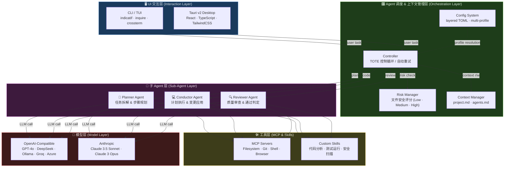

# HarnessCode 🤖🔒

> **The first AI coding agent built on cybernetics and absolute safety.**

[](LICENSE)
[](https://www.rust-lang.org)

---

## Vision

HarnessCode is an **enterprise-grade, cybernetics-inspired AI coding assistant** that treats safety and
correctness as first-class citizens. It combines the rigour of control-theory feedback loops with the
power of modern large language models, giving teams a coding agent that is:

- **Safe by design** — every file-system write is risk-scored before execution.
- **Observable** — a cybernetic controller records every action, compares actual vs. expected
  outcomes, and corrects course automatically.
- **Token-efficient** — a multi-agent pipeline (Planner → Conductor → Reviewer) keeps context windows
  small and focused.
- **Dual-UX** — ships as a beautiful TUI/CLI _and_ as a native desktop app powered by Tauri v2 with
  a Generative UI (React + TypeScript + TailwindCSS).

---

## Architecture

### 架构分层图



---

### Codebase Overview

```
┌──────────────────────────────────────────────────────────┐
│                      HarnessCode                         │
│                                                          │
│  ┌──────────────────────────────────────────────────┐    │
│  │               crates/core  (Engine)              │    │
│  │                                                  │    │
│  │  ┌─────────┐  ┌─────────┐  ┌────────────────┐   │    │
│  │  │ Planner │→ │Conductor│→ │    Reviewer    │   │    │
│  │  └────┬────┘  └────┬────┘  └───────┬────────┘   │    │
│  │       └─────────────┴──────────────┘            │    │
│  │              Controller (feedback loop)          │    │
│  │                   │                              │    │
│  │          RiskManager (file safety)               │    │
│  └──────────────────────────────────────────────────┘    │
│                                                          │
│  ┌───────────────┐        ┌────────────────────────┐     │
│  │  crates/cli   │        │   apps/desktop         │     │
│  │  (TUI/CLI)    │        │   Tauri v2 + React     │     │
│  └───────────────┘        └────────────────────────┘     │
└──────────────────────────────────────────────────────────┘
```

### Cybernetics Control Loop

HarnessCode implements a classic **TOTE** (Test-Operate-Test-Exit) cybernetic loop:

1. **Test** — Planner evaluates the current codebase state against the desired goal.
2. **Operate** — Conductor executes the plan inside a sandboxed environment.
3. **Test** — Reviewer checks outputs (tests, linting, risk scores) against success criteria.
4. **Exit** — Loop terminates when criteria are met, or escalates to the human operator.

### Risk Management

Every file touched by HarnessCode is run through the `RiskManager`:

| Risk Level | Trigger                           | Action           |
| ---------- | --------------------------------- | ---------------- |
| `Low`      | General source files              | Auto-proceed     |
| `Medium`   | Config files, CI scripts          | Log a warning    |
| `High`     | Auth files, secrets, `Cargo.toml` | Block + ask user |

### Multi-Agent Collaboration

| Agent    | Responsibility                                                                |
| -------- | ----------------------------------------------------------------------------- |
| Planner  | Decomposes the task into atomic steps, maintains the `agents.md` context file |
| Conductor | Executes the plan — applies changes and runs commands in an isolated sandbox  |
| Reviewer | Runs tests, linting, security scans, and decides pass/fail                    |

---

## Workspace Structure

```
HarnessCode/
├── Cargo.toml              # Workspace root
├── README.md
│
├── crates/
│   ├── core/               # Library: shared engine & brain
│   │   └── src/
│   │       ├── lib.rs
│   │       ├── agents/        # Agent trait + concrete implementations
│   │       ├── controller/    # Cybernetic Controller, guardrails, events
│   │       ├── tools/         # Tool registry and built-in tools
│   │       └── context/
│   │
│   └── cli/                # Binary: Terminal UI entry point
│       └── src/
│           └── main.rs
│
└── apps/
    └── desktop/            # Tauri v2 desktop application
        ├── package.json    # Frontend deps (React, TailwindCSS)
        ├── index.html
        ├── src/            # React + TypeScript frontend
        └── src-tauri/      # Rust backend (Tauri commands)
```

---

## Getting Started

### Prerequisites

- [Rust 1.75+](https://rustup.rs/)
- [Node.js 18+](https://nodejs.org/) _(for the desktop app)_
- [Tauri v2 prerequisites](https://tauri.app/start/prerequisites/)

### Run the CLI

```bash
cargo run -p harnesscode-cli
```

### Run the Desktop App

```bash
cd apps/desktop
npm install
npm run tauri dev
```

### Build Everything

```bash
cargo build --workspace
```

---

## Contributing

1. Fork the repository.
2. Create a feature branch: `git checkout -b feat/my-feature`.
3. Run `cargo clippy -- -D warnings` and `cargo test` before opening a PR.
4. Open a pull request and describe your changes.

---

## License

This project is licensed under the **MIT License** — see the [LICENSE](LICENSE) file for details.
